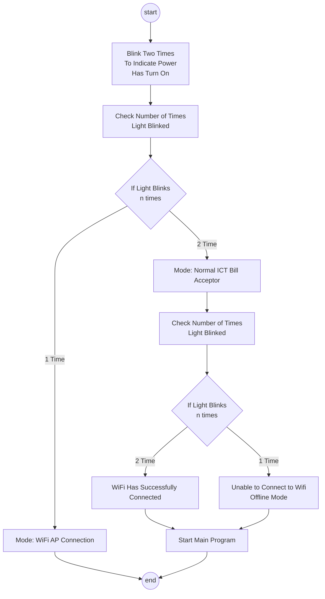

# Documentation

## Light Blinks Process Flow

## Video Listing

* [blink_2_times.mp4](./video/blink_2_times.mp4)

Two signals at start indicate detected power Surge On

* [blink_3_times.mp4](./video/blink_3_times.mp4)

Three signals means operation complete.\
Could be:
1. machine reset
2. Saved WiFi credentials

* [ict_mode_con_wifi.mp4](./video/ict_mode_con_wifi.mp4)

Normal run through, able to connect WiFi\
Blink 2 times, power signal on\
Blink 1 time, ICT bill mode\
Blink 2 times, WiFi connected successfully\
Blink 1 time, power on

* [btn_reset.mp4](./video/btn_reset.mp4)

Reset Pico to empty WiFi credentials
Long Press Button for 2~3 seconds

* [blink_3_times.mp4](./video/blink_3_times.mp4)

Three signals means operation complete.
Machine has been successfully reseted

* [wifi_mode.mp4](./video/wifi_mode.mp4)

Machin Is Reset\
Blink 2 times - power signal on\
Blink 2 times - WiFi mode 2\
Blink 1 time to indicate power

* [wiFi_Ap_ScreenShare.mp4](./video/wiFi_Ap_ScreenShare.mp4)

PiCo WiFi Ap Mode has been activated.\
User will now enter their WiFi Credentials to allow vgppq to connect

* [blink_3_times.mp4](./video/blink_3_times.mp4)

Three signals means operation complete.\
WiFi Credentials has been successfully saved

* [ict_mode_offline.mp4](./video/ict_mode_offline.mp4)

Unable to Connect WiFi Run Through\
Blink 2 times, power signal on\
Blink 1 time, ICT bill mode\
Blink 1 times, Unable to Connect To WiFi\
Blink 1 time, power on