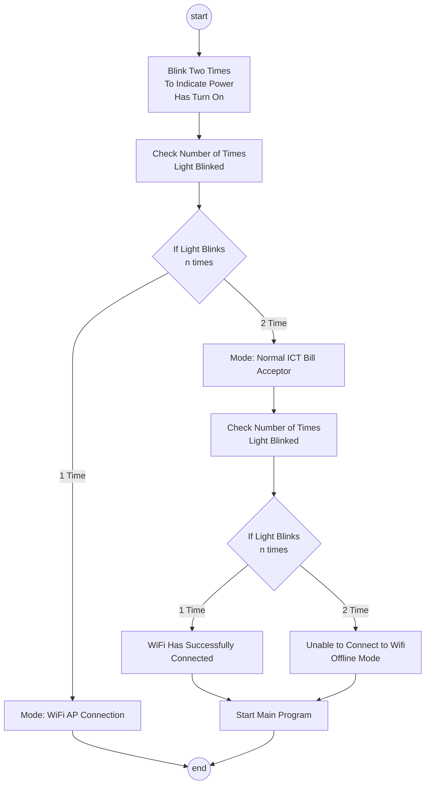

# VG PPQ Ict Bill Acceptor

## Overview

This project involves creating a MicroPython-based system that interfaces with an ICT Bill Acceptor to read hex signals, interpret them, and communicate with a motherboard device responsible for dispensing coin tokens. The solution is designed to be efficient, reliable, and easy to integrate into existing vending or arcade machine setups.

## Features

* Hex Signal Interpretation: Reads and decodes hex signals from the ICT Bill Acceptor.
* Coin Token Dispensing: Sends commands to a motherboard to dispense the correct number of coin tokens.
* MicroPython-Based: Utilizes MicroPython for efficient and lightweight code execution.
* Serial Communication: Uses UART for reliable communication between the bill acceptor, the MicroPython microcontroller, and the motherboard.
* Modular Design: Easy to integrate and modify for different hardware configurations and requirements.

## Components

* ICT Bill Acceptor: Hardware that accepts bills and sends hex signals indicating the value of the accepted bill.
* MicroPython Microcontroller: Executes the code to interpret signals and control the dispensing mechanism.
* Motherboard Device: Receives commands from the microcontroller and actuates the coin token dispenser.

## Requirements

* MicroPython-compatible microcontroller (e.g., ESP8266, ESP32)
* ICT Bill Acceptor
* Coin token dispenser and corresponding motherboard
* UART interface cables
* Power supply for the microcontroller and peripherals

## Setup and Installation

### Hardware Connections

Connect the ICT Bill Acceptor to the microcontroller via the UART interface.
Connect the microcontroller to the motherboard of the coin token dispenser using another UART interface or appropriate GPIO pins.
Ensure all devices are powered correctly and securely connected.

### MicroPython Environment Setup

Install the MicroPython firmware on your microcontroller. Follow the official MicroPython documentation for your specific device.
Use a tool like ampy or rshell to upload the Python scripts to the microcontroller.

### Code Upload

Upload the provided MicroPython script main.py to the root directory of your microcontroller.

### Configuration

Please ensure that the project directory is configured as below

```markdown
project
├───ap_templates
│   ├───configured.html
│   ├───index.html
│   └───redirect.html
├───img
│   ├───logo.txt
│   ├───wifi_a.txt
│   └───wifi_b.txt
├───phew
│   ├───__init__.py
│   ├───dns.py
│   ├───logging.py
│   ├───ntp.py
│   ├───server.py
│   └───template.py
├───utils
│   ├───__init__.py
│   ├───clsConst.py
│   └───clsUtils.py
├───ict_pico.py
├───main.py
└───ws_server.py
```

## Light Blinks Process Flow



## Contributing

If you'd like to contribute to this project, please follow these steps:

1. Fork the repository.
2. Create a new branch (`git checkout -b feature-branch`).
3. Make your changes.
4. Commit your changes (`git commit -am 'Add new feature'`).
5. Push to the branch (`git push origin feature-branch`).
6. Create a new Pull Request.

## License

This project is licensed under the [MIT License](./MIT-LICENSE.txt).
